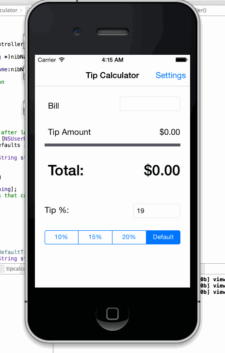

# tipcalculator

This is the iOS Objective-C training course prework exercise to create a tip calculator. 
see the [Instruction](https://gist.github.com/timothy1ee/7747214) for detail of what this exercise about.

Time spent: 6 hours spent in total

Completed user stories:

 * [x] Required: get the basic tip calculator functionality
 * [x] Required: Adding Tip Calculator Settings Page
 * [ ] Optional: View Animations
 
Notes:

Still confuse about how to get view animation running after spend sometime playing around. Could have more guidance here. 

Walkthrough of all user stories:

GIF created with [LiceCap](http://www.cockos.com/licecap/).
